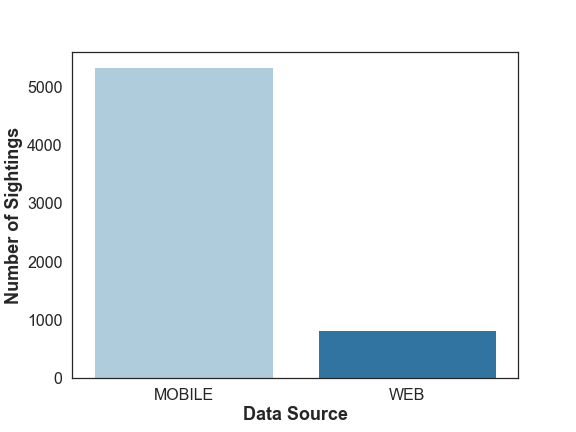
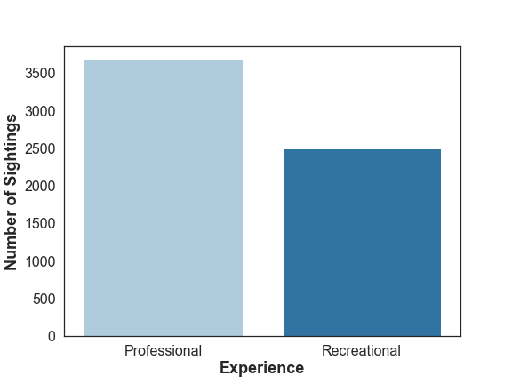
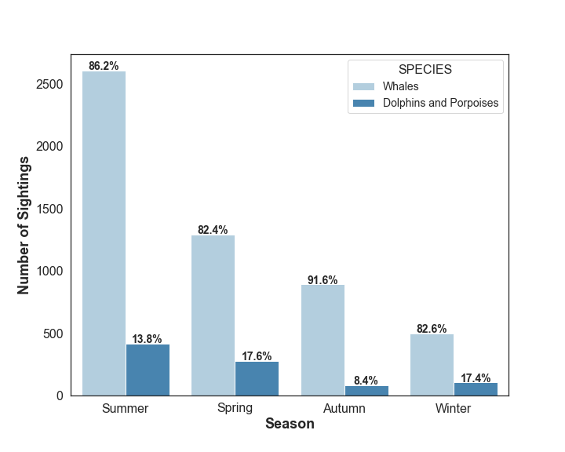
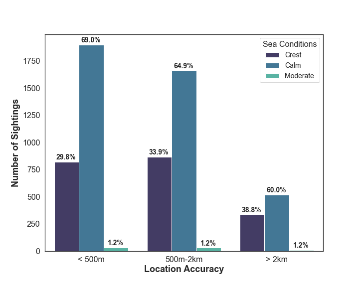

# Determining-Location-Accuracy
Final Project for LightHouse Labs Data Science Bootcamp, in partnership with OceanWise.

## *Disclaimer*
This repo does not illstrate all my work, just the final product after 10 days for my CapStone Project at LHL (presented on March 31, 2022). In this repo you will see some plots, old models trained, in addition to a toy dataset, requirements.txt and python file for running the model.

# Table of Contents
* [Aim](#aim)
* [About Ocean Wise](#about-ocean-wise)
* [Project Description](#project-description)
* [Trends in the Data](#trends-in-the-data)
* [The Approach](#the-approach)
* [Limitation](#limitations)
* [Results](#results)
* [Further Improvements](#further-improvements)
* [How to Work the Model](#how-to-work-the-model)

# Aim
The aim of this project is to streamline the process of determining location accuracy of whale, dolphin and turle sightings off the coast of British Columbia.

# About Ocean Wise

OceanWise Conservation Association is a nonprofit Organization based in Vancouver, British Columbia. Their mission is to protect our world's oceans and freshwater through empowering communities and individuals to take action. OceanWise also conducts research on marine mammals, ocean polution, and plastics.

To learn more about Ocean Wise, you can go [here](https://ocean.org/).

# Project Description
This project will determine the location accuracy of animal sightings using data from OceanWise BC Cetacean Sightings Network. Using machine learning, the goal is to create a classification model that can accurately predict the location accuracy. 

Location accuracy takes into account the observer’s specific coordinates that are reported in order to find the animal's proximity. This is because the coordinates submitted are of the observer's position (ie. mobile submission) and not the actual animal, so we want to know how close the observer actually was. 

At the end of the project, the aim is to be able to deploy a model that will intake data and predict the location accuracy for each new animal sighting, thereby automating and streamlining the process for staff at OceanWise. 

# Trends in the Data

## Data Collection

The plot above demonstrates that from the small data sample we have from 2017 to 2021, that the majority of data collected by the B.C. Cetacean Sightings Network is collected via the mobile app, Whale Report.

## Observer Experience

## Temporal

## Water Conditions

# The Approach

In the span of less than 10 days, my approach was rather straightforward. The majority of my time was spent cleaning the data and looking at feature engineering, followed by data analysis.

Steps Included:
1. Finding null strings
2. Fixing grammar in categorical features
3. Filling nulls
4. Applying limitations to the dataset
5. Creating features
6. Exploratory Data Analysis

After this, I went ahead and ran baseline pipelines to check how different preprocessing of features my impact the model. Once this was done and the final pipeline was built I ran several models: Logistic Regression, SVC, Random Forest and XGBoost (especially since the data was non-linear).

# Limitations
Finding Location Accuracy of cetaceans can be quite difficult, this is because your target is in constant motion.However, when it came to the limitations of my data for training a model there were two major limitations. 

First, 37% of rows my target variable were missing and as I had no way to fill these out, this resulted in me dropping the data from approx. 21000 to 13000 rows. 

The second limitation also dealt with the target variable. The target variable had 13 categories, which had to be binned. However on top of this, the data was extemely unbalanced as one category had 66% of the data. As such I had to apply a limitation following how the organization's protocol of how they handle their data to avoid this. As such, I was left with approx. 6400 rows of data.

# Results

# Further Improvements
There are number of methods that can be done to improve this model.

1. More Data - I was quite Limited.
2. Identify if coordinates are on land
3. Further Feature Engineering:
    * Use geopy on ranges of sighting distance given by observer and find average.
    * Further group other features such as Sighting Platform
4. Try a Deep Learning Model

# How to Work the Model