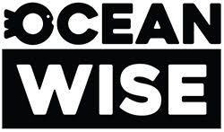
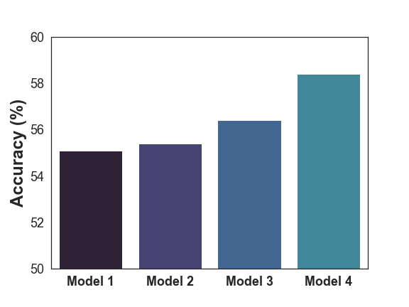
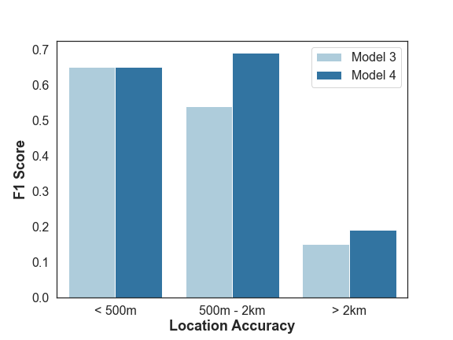

# Determining-Location-Accuracy
This repo showcases my CapStone Project at LightHouse Labs (presented on March 31, 2022) in partnership with Ocean Wise.

## *Disclaimer*
This repo does not include the real data used to create the model. The toy dataset in this repo however, represents what data is expected as input by the model. Furthermore:

*Data obtained from the B.C. Cetacean Sightings Network were collected opportunisticailly with limited knowledge of the temporal or spatial distribution of observer effort. A series of calculations used in Geographic Information Systems (GIS) framework were undertaken to reconstruct the distribution of observer effort1.*

# Table of Contents
* [About Ocean Wise](#about-ocean-wise)
* [Project Description](#project-description)
* [How to Run the Model](#how-to-run-the-model)
* [Limitations of the Model](#limitations)
* [Results](#results)
* [Further Improvements](#further-improvements)
* [References](#references)

# About Ocean Wise 🐳

    

Ocean Wise Conservation Association is a non-profit Organization based in Vancouver, British Columbia. Their mission is to protect our world's oceans and freshwater through empowering communities and individuals to take action. OceanWise also conducts research on marine mammals, ocean polution, and plastics.

To learn more about Ocean Wise, you can click [here](https://ocean.org/).

# Project Description
This project will determine the location accuracy of animal sightings using data from OceanWise B.C. Cetacean Sightings Network. Using machine learning, the goal is to create a classification model that can predict the location accuracy. 

Location accuracy takes into account the observer’s specific coordinates that are reported in order to find the animal's proximity. This is because the coordinates submitted are of the observer's position (ie. mobile location) and not the actual animal, so we want to know how close the observer actually was. 

At the end of the project, the aim is to be able to deploy a model that will intake data and predict the location accuracy for each new animal sighting, thereby automating and streamlining the process for staff at OceanWise. 

# How to Run the Model
The baseline model has been deployed on Streamlit. Click [here](https://share.streamlit.io/mudsnail/determining-location-accuracy/main).

You will see that you have the option to predict Location Accuracy for a single sighting. Go ahead and play around with different inputs and see what you get!

You can also predict the Location Accuracy for multiple sightings. You can use the Toy Dataset attached to this Repo and try it out.

# Limitations of the Model
Finding Location Accuracy of cetaceans can be quite difficult, this is because your target is in constant motion. However, when it came to the limitations for training a model there were two major limitations. First, 37% of rows my target variable were missing and had to be dropped. Second, another limitation had to be applied to reduce any bias in the model. Thus resulting in a small dataset.

# Results

After the final pipeline was built, I ran several models: Logistic Regression, SVC, Random Forest and XGBoost (especially since the data was non-linear). As a result of the limitations to my data, the accuracies of the resulting models were not high, but it proves the concept that we can predict Location Accuracy.

    

The biggest take away is that there was only one major difference between Model 3 and Model 4. Both used XGBoost, but Model 4 included another column that had 36% of missing data, which this model can handle. This increased the accuracy by 2% as well. Looking more closely we can see that the F1 Score (ie. Sensitivity and Specificity of the model's ability to predict the target values) increased for two categories.

    

# Further Improvements
There are number of methods that can be done to improve this model, which include:

1. More Data.
2. Identify if coordinates are on land
3. Further Feature Engineering:
    * Use geopy.
4. Try a Deep Learning Model

# References

1. Rechsteiner, E.U, Birdsall, C.F.C., Sandilands, D., Smith, I.U., Phillips, A.V., Barrett-Lennard, L.G. (2013). Quantifying observer effort for opportunistically collected wildlife sightings. B.C. Cetacean Sightings Network: Technical Report. Vancouver, B.C.: Ocean Wise Conservation Association. 43pp.